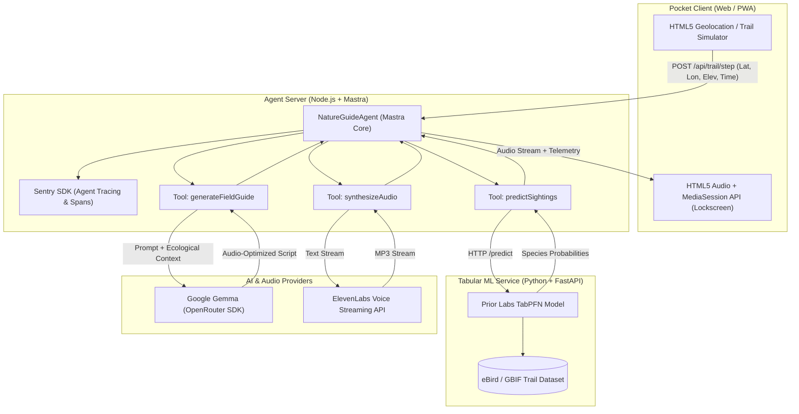

# 🌲 TrailWhisper

> **Screen-Zero, Pocket-First AI Audio Companion for Nature Trails**  
> *Predicts nearby flora and fauna sightings with tabular foundation models and whispers contextual nature stories directly through your earbuds as you hike.*

[](LICENSE)
[](https://mastra.ai)
[](https://github.com/automl/TabPFN)
[](https://deepmind.google/technologies/gemma/)
[](https://elevenlabs.io)
[](https://sentry.io)
[](https://render.com)

---

## 🧭 The Screen-Zero Experience

Most outdoor and nature guide apps force hikers to keep their eyes glued to phone screens while walking through forests and trails. **TrailWhisper** inverts the interaction paradigm:

1. **Keep Your Phone in Your Pocket**: Audio streams directly to your headphones or earbuds as you walk.
2. **Tabular Foundation Model Predictions**: Prior Labs' **TabPFN** evaluates hyper-localized ecological factors (GPS coordinates, elevation, hour, month, canopy density, and temperature) against curated trail biodiversity data to estimate species sighting probabilities in real time.
3. **Conversational Audio Whispers**: Google's open-weight **Gemma** (`google/gemma-4-26b-a4b-it:free` via the **OpenRouter SDK**) synthesizes concise, immersive 3-to-4 sentence spoken field notes directing your senses outward into the canopy or trail edges (*"Take a gentle pause and tilt your head up toward the higher cedar boughs... Hear that metallic rattle? That's a Steller's Jay caching cones..."*).
4. **Natural Hands-Free Voice**: **ElevenLabs** streams fluid, low-latency spoken audio directly to your earbuds, paired with the HTML5 Media Session API for lock-screen media controls so your screen stays dark.
5. **Observability**: **Sentry Agent Tracing** instruments the entire multi-model pipeline with OpenTelemetry spans tracking latency, tool execution, and token counts.

---

## ⚡ Architecture & Technology Stack

TrailWhisper couples a TypeScript agent orchestrator with a specialized Python ML microservice:

| Component | Technology | Role & Integration |
| :--- | :--- | :--- |
| **Agent Orchestrator** | TypeScript, Node.js, `@mastra/core` | Centralizes agent state, session memory, tool coordination (`predictSightings`, `generateFieldGuide`, `synthesizeAudio`), and pipeline dispatch. |
| **Tabular Biodiversity Engine** | Python 3.11, Prior Labs `TabPFN`, FastAPI | Ingests trail biodiversity datasets (eBird/GBIF observations) and leverages TabPFN tabular foundation models to predict top species occurrence probabilities. |
| **Reasoning & Audio Scripts** | Google's open-weight `Gemma` via `@openrouter/sdk` | Generates audio-first narration prompts with zero markdown formatting, spoken cadence, and directional sensory cues. |
| **Voice Synthesis Engine** | ElevenLabs Node SDK & Streaming API | Streams lifelike, natural-pacing narration audio directly to the hiker's headphones with zero screen interaction. |
| **Client Interface** | Vite, React, TypeScript, HTML5 Web APIs | Mobile-ready PWA featuring device Geolocation tracking, lock-screen MediaSession controls, a live TabPFN radar HUD, and an Alpine Trail Simulator. |
| **Observability** | `@sentry/node`, OpenTelemetry | Captures distributed trace waterfalls for agent runs, tool latency, and token metrics. |
| **Deployment** | Render Blueprint (`render.yaml`), Docker | Multi-service orchestration managing the Python ML worker, Node agent service, and Vite static PWA. |

---

## 🏛️ System Architecture



---

## 📂 Repository Structure

```
trailwhisper/
├── apps/
│   ├── agent-server/              # Mastra orchestrator + Sentry agent tracing (Node.js)
│   │   ├── src/
│   │   │   ├── mastra/
│   │   │   │   ├── agents/        # NatureGuideAgent definition
│   │   │   │   ├── tools/         # TabPFN, Gemma, and ElevenLabs tools
│   │   │   │   └── index.ts       # Mastra core exports
│   │   │   ├── sentry.ts          # Sentry OpenTelemetry spans & profiling
│   │   │   └── server.ts          # Express API server (/api/trail/step)
│   │   ├── Dockerfile
│   │   └── package.json
│   └── web/                       # Screen-zero Pocket PWA Client (Vite + React)
│       ├── src/
│       │   ├── components/        # AudioPlayer, SightingsRadar, TelemetryDrawer
│       │   ├── utils/             # Olympic Trail Simulator & waypoints
│       │   ├── App.tsx            # Pocket mode HUD
│       │   └── index.css          # Forest dark mode & glassmorphism
│       └── package.json
├── services/
│   └── tabpfn-service/            # Python FastAPI microservice for TabPFN
│       ├── app.py                 # /predict and /health endpoints
│       ├── data/                  # Sample trail observation CSV (eBird/GBIF)
│       ├── requirements.txt
│       └── Dockerfile
├── render.yaml                    # Multi-service Render deployment Blueprint
├── package.json                   # Root package.json (npm workspaces)
└── README.md
```

---

## 🚀 Quickstart Guide

### 1. Prerequisites
- **Node.js**: v20+
- **Python**: 3.11+
- **OpenRouter API Key**: for Google Gemma model inference
- **ElevenLabs API Key**: for natural voice streaming

### 2. Configure Environment Variables
Copy `.env.example` to `.env`:
```bash
cp .env.example .env
```
Fill in your credentials:
```env
OPENROUTER_API_KEY=your_openrouter_api_key_here
GEMMA_MODEL_NAME=google/gemma-4-26b-a4b-it:free
ELEVENLABS_API_KEY=your_elevenlabs_api_key_here
ELEVENLABS_VOICE_ID=JBFqnCBsd6RMkjVDRZzb
TABPFN_API_KEY=your_tabpfn_api_key_here
SENTRY_DSN=your_sentry_dsn_here
TABPFN_SERVICE_URL=http://localhost:8000
```

### 3. Launch the Python TabPFN Microservice
```bash
cd services/tabpfn-service
pip install -r requirements.txt
python app.py
```
*Health check available at: `http://localhost:8000/health`*

### 4. Launch the Mastra Agent Server
```bash
npm install
npm run dev:agent
```
*Agent server listening at: `http://localhost:4000`*

### 5. Launch the Pocket PWA Client
```bash
npm run dev:web
```
*Open `http://localhost:3000` in your desktop or mobile browser.*

---

## 🎧 Testing the Screen-Zero Experience

1. Connect your earbuds and open `http://localhost:3000`.
2. Toggle **Pocket Mode Active**.
3. Use the **Trail Simulator** to step through Olympic Trail waypoints (Valley floor → Hemlock groves → Old growth ridge → Subalpine meadow).
4. Watch the lock-screen or notification bar:
   - Media Session controls display the current species (e.g., *"Whisper: Steller's Jay nearby"*).
   - Play/pause or trigger the next waypoint directly from your headphones or lock-screen without unlocking your phone.
5. Inspect real-time **Sentry Agent Tracing** spans and TabPFN confidence scores in the telemetry drawer.

---

## 🚢 Production Deployment (Render)

This repository includes a multi-service [`render.yaml`](./render.yaml) Blueprint:

1. Push your repository to GitHub.
2. In the [Render Dashboard](https://dashboard.render.com), click **New +** → **Blueprint**.
3. Connect your repository. Render automatically provisions and deploys:
   - `trailwhisper-tabpfn`: Python 3.11 Docker Web Service.
   - `trailwhisper-agent`: Node.js 20 Docker Web Service with Mastra & Sentry.
   - `trailwhisper-web`: Static React PWA with automatic routing.

---

## 📜 License
MIT License.