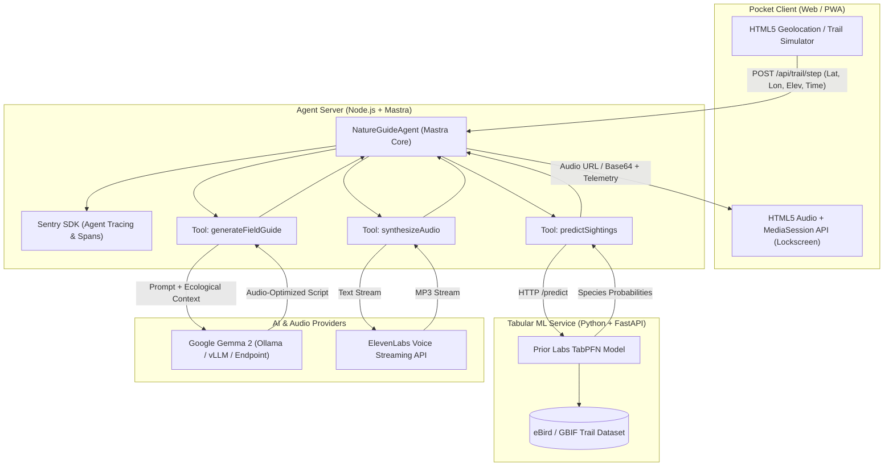

# 🌲 TrailWhisper

> **Screen-Zero, Pocket-First AI Audio Companion for Nature Trails**  
> *Built for Hacktoberfest 2026 Week 1 Challenge ("Touch Grass" — Oct 5–11, 2026)*

[](LICENSE)
[](https://mastra.ai)
[](https://github.com/automl/TabPFN)
[](https://deepmind.google/technologies/gemma/)
[](https://elevenlabs.io)
[](https://sentry.io)
[](https://render.com)

---

## 🧭 The Vision: Screen-Zero & "Touch Grass"

Most outdoor apps force hikers to stare at blue-light screens while walking through pristine forests. **TrailWhisper** flips the interaction paradigm:

1. **Phone stays tucked in your pocket**: Audio streams straight to your earbuds.
2. **Tabular Foundation Model Intelligence**: Prior Labs' **TabPFN** predicts hyper-localized flora and fauna sightings based on your trail GPS, elevation, canopy density, hour, and temperature.
3. **Conversational Whispers**: Google's open-weight **Gemma** (`google/gemma-4-26b-a4b-it:free` via the **OpenRouter SDK**) crafts concise, 3-to-4 sentence spoken field notes directing your senses outward ("*Tilt your head up into the cedar boughs—notice that metallic rattle? That's a Steller's Jay caching cones...*").
4. **Natural Hands-Free Voice**: **ElevenLabs** streams fluid, low-latency audio to your headphones, synchronized with lock-screen media controls via the HTML5 Media Session API.
5. **Observability**: **Sentry Agent Tracing** instruments the entire multi-model pipeline with OpenTelemetry spans.

---

## 🏆 Target Hackathon Prize Categories Satisfied

| Partner Prize | Track Requirement | How TrailWhisper Satisfies It |
| :--- | :--- | :--- |
| **Best Use of TabPFN ($200)** | Use TabPFN tabular foundation model | TabPFN microservice (`services/tabpfn-service`) fits on trail observation datasets (eBird/GBIF) to yield top species probabilities without manual model re-training. |
| **Best Use of Gemma ($200)** | Use Google's open-weight Gemma model | Mastra tool `generateFieldGuide` invokes Google's open-weight Gemma model (`google/gemma-4-26b-a4b-it:free`) via the official `@openrouter/sdk` with strict screen-zero audio prompting (zero markdown, sensory directional cues, natural speech pacing). |
| **Best Use of Mastra ($100)** | Orchestrate agent, memory & tools with Mastra | Mastra orchestrator (`apps/agent-server/src/mastra`) organizes the `NatureGuideAgent` and chains the tabular, reasoning, and voice tools. |
| **Best Use of ElevenLabs ($100)** | Stream synthesized speech for listening | Mastra tool `synthesizeAudio` streams speech via ElevenLabs Turbo v2.5 directly to the client's Web Audio pipeline. |
| **Best Use of Render ($200)** | Production deployment configuration | Production Blueprint [`render.yaml`](./render.yaml) and Dockerfiles deploy the Python ML worker, Node agent, and Vite PWA. |
| **Best Use of Sentry ($100)** | Instrument AI Agent Tracing | `@sentry/node` instruments OpenTelemetry spans (`ai.agent.trail_step`, `ai.tool.tabpfn.predict`, `ai.tool.gemma.generate`, `ai.tool.elevenlabs.tts`). |

---

## 🏛️ System Architecture



---

## 📂 Repository Structure

```
trailwhisper/
├── apps/
│   ├── agent-server/              # Mastra orchestrator + Sentry agent tracing (Node.js)
│   │   ├── src/
│   │   │   ├── mastra/
│   │   │   │   ├── agents/        # NatureGuideAgent definition
│   │   │   │   ├── tools/         # TabPFN, Gemma 2, and ElevenLabs tools
│   │   │   │   └── index.ts       # Mastra core exports
│   │   │   ├── sentry.ts          # Sentry OpenTelemetry spans & profiling
│   │   │   └── server.ts          # Express API server (/api/trail/step)
│   │   ├── Dockerfile
│   │   └── package.json
│   └── web/                       # Screen-zero Pocket PWA Client (Vite + React)
│       ├── src/
│       │   ├── components/        # AudioPlayer, SightingsRadar, TelemetryDrawer
│       │   ├── utils/             # Olympic Trail Simulator & waypoints
│       │   ├── App.tsx            # Pocket mode HUD
│       │   └── index.css          # Rich forest dark mode & glassmorphism
│       └── package.json
├── services/
│   └── tabpfn-service/            # Python FastAPI microservice for TabPFN
│       ├── app.py                 # /predict and /health endpoints
│       ├── data/                  # Sample trail observation CSV (eBird/GBIF)
│       ├── requirements.txt
│       └── Dockerfile
├── render.yaml                    # Multi-service Render deployment Blueprint
├── package.json                   # Root package.json (npm workspaces)
└── README.md
```

---

## 🚀 Quickstart Guide

### 1. Prerequisites
- **Node.js**: v20+
- **Python**: 3.11+ (recommended for native PyTorch & TabPFN weights)
- (Optional) **Ollama**: running `ollama run gemma2:2b`
- (Optional) **ElevenLabs API Key**: for production voice streaming

### 2. Configure Environment Variables
Copy `.env.example` to `.env`:
```bash
cp .env.example .env
```
Fill in your credentials:
```env
OPENROUTER_API_KEY=your_openrouter_api_key_here
GEMMA_MODEL_NAME=google/gemma-4-26b-a4b-it:free
ELEVENLABS_API_KEY=your_key_here
SENTRY_DSN=your_sentry_dsn_here
TABPFN_SERVICE_URL=http://localhost:8000
```

### 3. Launch the Python TabPFN Microservice
```bash
cd services/tabpfn-service
pip install -r requirements.txt
python app.py
```
*Health check available at: `http://localhost:8000/health`*

### 4. Launch the Mastra Agent Server
```bash
npm install
npm run dev:agent
```
*Agent server listening at: `http://localhost:4000`*

### 5. Launch the Pocket PWA Client
```bash
npm run dev:web
```
*Open `http://localhost:3000` in your desktop or mobile browser.*

---

## 🎧 Testing Screen-Zero Pocket Mode

1. Connect your earbuds and open `http://localhost:3000`.
2. Toggle **Pocket Mode Active**.
3. Use the **Trail Simulator** to step through the Olympic Trail waypoints (Valley floor → Hemlock groves → Old growth ridge → Subalpine meadow).
4. Watch the lock-screen or notification bar:
   - Media Session controls will display the current species (e.g., *"Whisper: Steller's Jay nearby"*).
   - Press play/pause directly from your headphones or lock-screen without unlocking your device!
5. Inspect real-time **Sentry Agent Tracing** spans and TabPFN confidence scores in the telemetry drawer.

---

## 🚢 Deploying to Render

This repository includes a multi-service [`render.yaml`](./render.yaml) Blueprint:

1. Push your repository to GitHub.
2. In the [Render Dashboard](https://dashboard.render.com), click **New +** → **Blueprint**.
3. Connect your repository. Render will automatically detect and deploy:
   - `trailwhisper-tabpfn`: Python 3.11 Docker Web Service.
   - `trailwhisper-agent`: Node.js 20 Docker Web Service with Mastra & Sentry.
   - `trailwhisper-web`: Static React PWA with automatic routing.

---

## 📜 License
MIT License. Crafted for Hacktoberfest 2026.