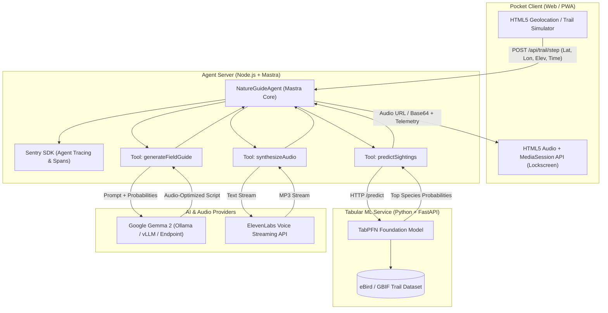

# TrailWhisper: System Architecture & Technical Specification

*Screen-Zero, Pocket-First AI Audio Companion for Nature Trails*

---

## 1. Executive Summary & Core Engineering Pillars

TrailWhisper predicts flora and fauna sightings along hiking trails using tabular foundation models and whispers contextual, immersive nature stories into the hiker's earbuds as they walk—keeping their eyes on the trail and phone in their pocket.

| Architectural Pillar | Core Technology | Engineering Role & Integration |
| :--- | :--- | :--- |
| **Agent Orchestration & Storage** | Mastra (`@mastra/core`), `@mastra/libsql` | Agent state, persistent LibSQL/SQLite storage, memory, and workflow tools (`predictSightings`, `generateFieldGuide`, `synthesizeAudio`). |
| **Tabular Biodiversity Engine** | Prior Labs TabPFN & FastAPI | Tabular foundation model microservice evaluating real-time spatial and environmental trail data. |
| **Narration & Sensory Prompts** | Google Gemma via OpenRouter SDK | Spoken-first, markdown-free prompt synthesis tailored for immediate auditory delivery. |
| **Voice Streaming Engine** | ElevenLabs Streaming API | Ultra-low-latency voice synthesis streaming natural pacing to the hiker's headphones. |
| **Observability & Tracing** | Sentry Agent Tracing (`@sentry/node`) | Distributed OpenTelemetry spans tracking agent workflow, tool latency, and model metrics. |
| **Production Cloud Deployment** | Render Blueprint (`render.yaml`) | Multi-service orchestration for Python ML microservice, Node.js agent, and static web PWA. |

---

## 2. High-Level Architecture & Flow



---

## 3. Directory Layout (Monorepo)

```
trailwhisper/
├── apps/
│   ├── agent-server/              # Node.js + Mastra + Sentry Orchestrator
│   │   ├── src/
│   │   │   ├── mastra/
│   │   │   │   ├── agents/
│   │   │   │   │   └── natureGuide.ts     # Mastra Agent definition & prompt
│   │   │   │   ├── tools/
│   │   │   │   │   ├── tabpfnTool.ts      # Calls TabPFN FastAPI endpoint
│   │   │   │   │   ├── gemmaTool.ts       # Calls Gemma 2 endpoint/runner
│   │   │   │   │   └── elevenlabsTool.ts  # Calls ElevenLabs TTS API
│   │   │   │   └── index.ts               # Mastra configuration export
│   │   │   ├── sentry.ts                  # Sentry Agent Tracing initialization
│   │   │   └── server.ts                  # HTTP API server & route handlers
│   │   ├── package.json
│   │   ├── tsconfig.json
│   │   └── Dockerfile
│   └── web/                       # Zero-Screen Pocket PWA Client
│       ├── public/
│       ├── src/
│       │   ├── App.tsx                    # Main UI: Pocket mode toggle, GPS tracker
│       │   ├── components/                # Audio player, Live sighting cards, Sentry badge
│       │   ├── utils/trailSimulator.ts    # GPS path simulator for indoor/desktop testing
│       │   └── index.css                  # Rich forest dark mode & glassmorphism
│       ├── index.html
│       ├── package.json
│       ├── vite.config.ts
│       └── tsconfig.json
├── services/
│   └── tabpfn-service/            # Python TabPFN Microservice
│       ├── app.py                         # FastAPI app exposing /predict and /health
│       ├── data/
│       │   └── trail_biodiversity.csv     # Curated GBIF/eBird trail observations
│       ├── requirements.txt
│       └── Dockerfile                     # Python 3.11 with TabPFN + PyTorch
├── render.yaml                    # Multi-service Render Blueprint (Agent + ML + Web)
├── package.json                   # Root package.json with npm workspaces
└── README.md                      # Complete setup, credentials, and architecture guide
```

---

## 4. Phase-by-Phase Implementation Roadmap

### Phase 1: Project Scaffolding & Dependencies (Current Step)
- Create root `package.json` for npm workspaces (`apps/agent-server`, `apps/web`).
- Create `services/tabpfn-service` with `requirements.txt`, sample biodiversity CSV, and FastAPI service skeleton.
- Create `apps/agent-server` with `package.json`, `tsconfig.json`, and initial folder structure.
- Create `apps/web` with Vite + React + TypeScript skeleton.

### Phase 2: Python TabPFN Microservice (`services/tabpfn-service`)
- Build realistic dataset with 500+ records of trail wildlife/flora occurrences (Pacific Northwest & alpine trails: Douglas Squirrel, Steller's Jay, Banana Slug, Western Redcedar, Red-tailed Hawk, Pacific Trillium, Black Bear).
- Implement FastAPI app with TabPFN classifier loading, zero-shot inference, and resilient fallback classifier (RandomForest / GradientBoosting) if running on environments without CUDA or compatible wheels.
- Implement `/predict` and `/health` endpoints with Pydantic validation.

### Phase 3: Mastra TypeScript Orchestrator (`apps/agent-server`)
- Initialize `@mastra/core` agent instance (`natureGuideAgent`).
- Implement Mastra Tools:
  - `predictSightings`: connects to TabPFN service with GPS coordinates and time.
  - `generateFieldGuide`: formats context and sends to Gemma 2 (Ollama / OpenAI-compatible / Gemini-fallback) with audio-specific instructions (no markdown, sensory cues, gentle speech rhythm).
  - `synthesizeAudio`: streams speech using ElevenLabs API with graceful fallback to web synthesis.
- Wrap workflow execution in Sentry OpenTelemetry spans (`ai.agent.run`, `ai.tool.tabpfn`, `ai.tool.gemma`, `ai.tool.elevenlabs`).

### Phase 4: Pocket-First Web/Mobile PWA (`apps/web`)
- Design ultra-clean, pocket-friendly UI (Forest Emerald & Obsidian dark mode, glassmorphism).
- Implement Geolocation watcher + interactive Trail Simulator (simulate walking a 2km trail with elevation and waypoints).
- HTML5 Audio & MediaSession API integration (controls on phone lock screen so the phone stays in the pocket).
- Telemetry view showing real-time TabPFN probabilities, Gemma scripts, and Sentry trace IDs.

### Phase 5: Render Deployment & Verification
- Create `render.yaml` declaring the FastAPI service, Node agent, and Web PWA.
- Configure production Dockerfiles and environment variables.
- Run end-to-end integration tests and verify full workflow.

---

## 5. Next Immediate Actions
1. Scaffold root `package.json` and `.gitignore`.
2. Scaffold `services/tabpfn-service` (`requirements.txt`, dataset, `app.py`, `Dockerfile`).
3. Scaffold `apps/agent-server` (`package.json`, `tsconfig.json`, Mastra agent, tools, Sentry).
4. Scaffold `apps/web` (`package.json`, Vite configuration, UI components).
